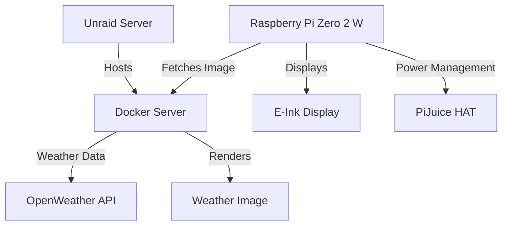

# Ultra-Low-Power Weather Display

[](https://github.com/sjnims/rpi_weather_display/actions/workflows/ci.yml)
[](https://codecov.io/gh/sjnims/rpi_weather_display)
[](https://www.python.org/downloads/release/python-3112/)
[](https://opensource.org/licenses/MIT)
[](https://github.com/astral-sh/ruff)

A power-optimized weather display solution for Raspberry Pi Zero 2 W with e-paper display, designed to achieve 60-90 days of battery life on a single charge.


*The e-paper display shows current weather conditions, forecast, and key metrics in a clean, high-contrast design optimal for e-ink. A preview of an early version of the generated HTML dashboard is shown above.*

## Table of Contents
- [Features](#features)
- [Latest Improvements](#latest-improvements)
- [User Experience](#user-experience)
- [Hardware Requirements](#hardware-requirements)
- [Prerequisites](#prerequisites)
- [Quickstart](#quickstart)
- [Installation](#installation)
  - [Client Setup](#client-setup)
  - [Server Setup](#server-setup)
  - [Manual Power Optimization](#manual-power-optimization)
- [Architecture](#architecture)
- [Configuration](#configuration)
- [Development](#development)
  - [Running the Application in Development Mode](#running-the-application-in-development-mode)
  - [Development Best Practices](#development-best-practices)
  - [Project Structure](#project-structure)
  - [Testing and Code Quality](#testing-and-code-quality)
  - [API Endpoints](#api-endpoints)
- [Power Optimization](#power-optimization)
- [Operation Guide](#operation-guide)
  - [Update Instructions](#update-instructions)
  - [Troubleshooting](#troubleshooting)
- [Security Considerations](#security-considerations)
- [Contributing](#contributing)
  - [Contribution Guidelines](#contribution-guidelines)
  - [Code Style](#code-style)
- [Roadmap](#roadmap)
- [Acknowledgements](#acknowledgements)
- [License](#license)

## Features

- Ultra-low-power consumption (60-90 days battery life)
- Beautiful e-paper weather display with current conditions and forecast
- Server-client architecture for minimal client power usage
- Comprehensive power management with aggressive optimizations
- Quiet hours support to conserve battery during night time
- Weather data from OpenWeatherMap API
- Automatic deep sleep between updates
- Browser-based preview for easier development

## Latest Improvements

- **Enhanced UI Elements**:
  - Wind direction shown as cardinal points (N, NE, E, etc.) with correctly oriented icons
  - Wind direction indicators now properly point to the direction wind is coming from
  - Air quality index display with descriptive labels based on OpenWeatherMap data

- **User Customization**:
  - Configurable pressure units (hPa, mmHg, inHg) through the config file
  - Customizable datetime formats for display elements
  - Support for multiple time format options (AM/PM or 24-hour)

- **Improved Data Display**:
  - More accurate high UV time prediction that persists between updates
  - Improved weather icon mapping for precise conditions visualization

## User Experience

The weather display shows a comprehensive dashboard including:

- Current weather conditions with temperature and weather icon
- Daily high and low temperatures
- Wind speed and direction (shown as cardinal points: N, NE, E, etc.)
- Barometric pressure (configurable in hPa, mmHg, or inHg units)
- Air quality index with descriptive labels (Good, Fair, Moderate, etc.)
- UV index with peak time indication
- 5-day forecast with icons and temperatures
- Sunrise and sunset times
- Last update timestamp with customizable formatting
- Battery status indicator showing charge level and state

The display is designed for maximum readability on e-paper, with high contrast and clean layout. The e-paper display only refreshes when necessary to conserve power, with updates typically occurring:

- Every 30 minutes during active hours
- Less frequently during quiet hours (23:00-06:00 by default)
- Less frequently when battery is low
- Immediately when the device wakes from deep sleep

## Hardware Requirements

- **Client**:
  - Raspberry Pi Zero 2 W
  - PiJuice Zero HAT
  - PiJuice 12,000 mAh LiPo battery
  - Waveshare 10.3″ 1872 x 1404 E-paper IT8951 HAT

- **Server**:
  - Docker container running on Unraid server (or any Linux server)
  - 12th Gen Intel® Core™ i9-12900K and 32GB RAM (overkill...I know)

## Prerequisites

Before installation, ensure you have:

- **Client (Raspberry Pi)**:
  - Raspberry Pi OS (Bookworm) installed and configured
  - Internet connectivity configured on the Raspberry Pi
  - PiJuice HAT properly connected and working
  - Waveshare e-paper display properly connected
  - Git installed (`sudo apt-get install git`)

- **Server**:
  - Docker installed and running
  - OpenWeatherMap API key ([sign up here](https://openweathermap.org/api))
  - Port 8000 available for the server (configurable)
  - Sufficient storage for caching weather data and images

## Quickstart

For experienced users who want to get up and running quickly:

```bash
# Client setup (Raspberry Pi)
git clone https://github.com/sjnims/rpi-weather-display.git
cd rpi-weather-display
sudo bash deploy/scripts/install.sh
sudo cp config.example.yaml /etc/rpi-weather-display/config.yaml
sudo nano /etc/rpi-weather-display/config.yaml  # Add your API key and settings

# Server setup (Linux/Docker)
docker build -t rpi-weather-display-server .
docker run -d --name rpi-weather-display -p 8000:8000 \
  -v /path/to/config.yaml:/etc/rpi-weather-display/config.yaml \
  rpi-weather-display-server
```

## Installation

### Client Setup

1. Clone this repository:
   ```bash
   git clone https://github.com/sjnims/rpi-weather-display.git
   cd rpi-weather-display
   ```

2. Run the installation script (requires Raspberry Pi OS Bookworm):
   ```bash
   sudo bash deploy/scripts/install.sh
   ```

   This script will:
   - Install Python 3.11 and required dependencies
   - Set up the application with Poetry
   - Apply comprehensive power optimizations
   - Configure the system for maximum battery life
   - Create and enable systemd service

3. Create configuration file:
   ```bash
   sudo mkdir -p /etc/rpi-weather-display
   sudo cp config.example.yaml /etc/rpi-weather-display/config.yaml
   sudo nano /etc/rpi-weather-display/config.yaml  # Edit as needed
   ```

4. The system will automatically reboot after installation and start the service.

### Server Setup

1. Build Docker image:
   ```bash
   docker build -t rpi-weather-display-server -f Dockerfile .
   ```

2. Run Docker container:
   ```bash
   docker run -d \
     --name rpi-weather-display \
     -p 8000:8000 \
     -v /path/to/config.yaml:/etc/rpi-weather-display/config.yaml \
     rpi-weather-display-server
   ```

### Manual Power Optimization

If you want to apply power optimizations separately:

```bash
sudo bash deploy/scripts/optimize-power.sh
```

## Architecture



The project uses a client-server architecture to maximize battery life:

- **Server**: Handles all computation-intensive tasks including:
  - Weather API calls and data processing
  - HTML rendering with Jinja2 templates
  - Image generation via Playwright
  - Caching strategy for API responses
  - FastAPI web server for client requests

- **Client**: Focuses on power efficiency:
  - Wakes up periodically to request updates
  - Displays pre-rendered images on e-paper display
  - Manages power and sleep cycles
  - Implements aggressive power-saving measures
  - Uses PiJuice for battery monitoring and deep sleep

### Data Flow

1. Client wakes from sleep mode
2. Checks if update is needed (based on time, battery level)
3. Enables WiFi in power-save mode
4. Requests image from server with current battery status
5. Server fetches weather data (if needed) and renders image
6. Client displays the image on e-paper display
7. Client disables WiFi and returns to sleep

## Configuration

Edit the `config.yaml` file to customize your setup. You should copy [config.example.yaml](config.example.yaml) to `config.yaml` and modify it with your settings:

```bash
cp config.example.yaml config.yaml
nano config.yaml  # or use your preferred editor
```

### Configuration Options

```yaml
weather:
  api_key: "YOUR_OPENWEATHERMAP_API_KEY"  # Required: Your OpenWeatherMap API key
  city_name: "London"                      # Optional: City name for display
  units: "metric"                          # Units: "metric", "imperial", "standard"
  language: "en"                           # Language for weather descriptions
  update_interval_minutes: 30              # How often to update weather data
  forecast_days: 5                         # Number of forecast days
  hourly_forecast_count: 24                # Number of hourly forecasts to show

display:
  width: 1872                              # Display resolution width
  height: 1404                             # Display resolution height
  rotate: 0                                # Display rotation (0, 90, 180, 270)
  refresh_interval_minutes: 30             # Display refresh interval
  partial_refresh: true                    # Use partial refresh for display
  timestamp_format: "%Y-%m-%d %H:%M"       # Format for timestamps in logs
  time_format: null                        # Format for time display (null = AM/PM)
  pressure_units: "hPa"                    # Pressure units: "hPa", "mmHg", "inHg"
  display_datetime_format: null            # Format for displayed dates (null = MM/DD/YYYY HH:MM AM/PM)

power:
  quiet_hours_start: "23:00"               # Start of quiet hours (reduced updates)
  quiet_hours_end: "06:00"                 # End of quiet hours
  low_battery_threshold: 20                # Battery % to enter power saving
  critical_battery_threshold: 10           # Battery % for critical power saving
  wake_up_interval_minutes: 60             # How often to wake from sleep

server:
  url: "http://your-server-ip"             # URL of the server
  port: 8000                               # Server port
  timeout_seconds: 10                      # API request timeout
  retry_attempts: 3                        # Number of retry attempts
  retry_delay_seconds: 5                   # Delay between retries
```

All configuration is managed through this YAML file - the project does not use environment variables or .env files.

Make sure to keep your `config.yaml` file secure as it contains your API keys. It's already added to the `.gitignore` file to prevent accidental commits.

## Development

To set up the development environment on macOS:

```bash
# Install Poetry (if not already installed)
curl -sSL https://install.python-poetry.org | python3 -

# Install dependencies (defined in pyproject.toml)
poetry install --with dev --extras server

# For server components
poetry install --extras server

# Install Playwright browsers (required for rendering images)
poetry run playwright install

# Run tests
poetry run pytest

# Check code with ruff
poetry run ruff check .

# Check types with pyright
poetry run pyright
```

All dependencies and dev tools are defined in [pyproject.toml](pyproject.toml).

### Running the Application in Development Mode

1. Start the server with a local config file:
   ```bash
   poetry run server --config config.yaml
   ```

2. In a separate terminal, run the client with the same config file:
   ```bash
   poetry run client --config config.yaml
   ```

3. Preview the dashboard in your browser:
   ```
   http://localhost:8000/preview
   ```
   This provides a live view of the dashboard for easier development and iteration.

4. Modify the HTML template in [templates/dashboard.html.j2](templates/dashboard.html.j2) and refresh the browser to see changes immediately. Partials are located in the same directory, and are split logically by area of focus: header, current weather, daily forecast, and hourly forecast.

### Development Best Practices

The project follows these development principles:

- **Type Safety**: Comprehensive type hints with Pyright strict mode
- **Testing**: Pytest with high coverage requirements (94%+)
- **Error Handling**: Robust exception handling for hardware interactions
- **Logging**: Structured logging with configurable levels
- **DRY Code**: Focus on code reuse and abstraction
- **Modern Python**: Using Python 3.11+ features

### Project Structure

```
rpi-weather-display/
├── pyproject.toml         # Project configuration and dependencies
├── config.example.yaml    # Example configuration file
├── src/
│   └── rpi_weather_display/
│       ├── client/        # Client code for Raspberry Pi
│       │   ├── display.py            # E-ink display integration
│       │   └── main.py               # Client application
│       ├── server/        # Server code for Docker container
│       │   ├── api.py                # API endpoints
│       │   ├── main.py               # Server application
│       │   └── renderer.py           # HTML and image rendering
│       ├── models/        # Shared data models
│       │   ├── config.py             # Configuration models
│       │   ├── system.py             # System status models
│       │   └── weather.py            # Weather data models
│       └── utils/         # Shared utilities
│           ├── battery_utils.py      # Battery management
│           ├── error_utils.py        # Error handling
│           ├── logging.py            # Structured logging
│           ├── network.py            # Network utilities
│           ├── power_manager.py      # Power optimization
│           └── time_utils.py         # Time-related utilities
├── deploy/
│   └── scripts/
│       ├── install.sh              # Installation script
│       └── optimize-power.sh       # Power optimization script
├── templates/             # HTML Jinja2 templates for the dashboard
│   ├── _base.html.j2              # Base template
│   ├── _current.html.j2           # Current weather section
│   ├── _forecast_daily.html.j2    # Daily forecast section
│   ├── _forecast_hourly.html.j2   # Hourly forecast section
│   ├── _header.html.j2            # Header section
│   └── dashboard.html.j2          # Main dashboard template
├── static/                # Static assets
│   ├── css/                       # Stylesheets
│   ├── fonts/                     # Custom fonts
│   ├── icons/                     # Weather and UI icons
│   └── images/                    # Images for documentation
└── tests/                 # Comprehensive test suite
    ├── client/                    # Client tests
    ├── models/                    # Model tests
    ├── server/                    # Server tests
    └── utils/                     # Utility tests
```

### Testing and Code Quality

- **Test Coverage**: 94.86% code coverage with comprehensive tests
- **Type Checking**: Strict typing with Pyright
- **Linting**: Uses Ruff for code style enforcement
- **CI/CD**: Automated tests and linting via GitHub Actions

The project implements thorough testing for all components, with particular attention to critical power management and display subsystems.

### API Endpoints

The server provides the following endpoints:

- `POST /render` - Used by the client to get a rendered image for e-paper display
- `GET /weather` - Returns weather data as JSON
- `GET /preview` - Renders the dashboard in a browser for development

## Power Optimization

The project implements numerous power-saving techniques to achieve 60-90 days of battery life:

- Offloading computation to the server
- CPU optimization:
  - CPU frequency limited to 700 MHz
  - Disabling 3 of 4 cores (single-core operation)
  - Power-efficient CPU governor
- Hardware power reduction:
  - HDMI, Bluetooth, and LEDs disabled
  - USB controller power management
  - Aggressive WiFi power saving modes
- Operation scheduling:
  - Deep sleep between refreshes
  - Quiet hours during night time
  - Adaptive refresh rates based on battery level
  - PiJuice integration for power management
- System optimizations:
  - Memory and filesystem optimizations via tmpfs
  - ZRAM for memory compression
  - Kernel parameter tuning
  - Disabling unnecessary services

All optimizations are automatically applied by the installation script, with additional controls available through the configuration file.

## Operation Guide

### Update Instructions

To update to the latest version:

#### Client Update

1. Stop the service:
   ```bash
   sudo systemctl stop rpi-weather-display.service
   ```

2. Navigate to the installation directory:
   ```bash
   cd /opt/rpiweather
   ```

3. Pull the latest changes:
   ```bash
   sudo -u rpiweather git pull
   ```

4. Reinstall dependencies:
   ```bash
   sudo -u rpiweather poetry install
   ```

5. Restart the service:
   ```bash
   sudo systemctl start rpi-weather-display.service
   ```

#### Server Update

1. Pull the latest Docker image or rebuild:
   ```bash
   # If using pre-built images
   docker pull sjnims/rpi-weather-display-server:latest

   # If building locally
   cd /path/to/repository
   git pull
   docker build -t rpi-weather-display-server .
   ```

2. Stop and remove the old container:
   ```bash
   docker stop rpi-weather-display
   docker rm rpi-weather-display
   ```

3. Start a new container:
   ```bash
   docker run -d \
     --name rpi-weather-display \
     -p 8000:8000 \
     -v /path/to/config.yaml:/etc/rpi-weather-display/config.yaml \
     rpi-weather-display-server
   ```

### Troubleshooting

#### Client Issues

1. **Display not updating**:
   - Check if the service is running: `sudo systemctl status rpi-weather-display.service`
   - Verify network connectivity: `ping 8.8.8.8`
   - Check server connectivity: `curl -v http://your-server:8000/`
   - Check logs: `sudo journalctl -u rpi-weather-display.service`

2. **Battery draining too quickly**:
   - Verify power optimizations are active: `cat /sys/devices/system/cpu/cpu0/cpufreq/scaling_governor`
   - Check WiFi power save mode: `iw dev wlan0 get power_save`
   - Check for CPU-intensive processes: `top -b -n 1`
   - Increase quiet hours or refresh intervals in config

3. **PiJuice issues**:
   - Verify PiJuice is detected: `i2cdetect -y 1`
   - Check PiJuice status: `pijuice_cli --status`
   - Ensure PiJuice firmware is up-to-date

#### Server Issues

1. **Server not responding**:
   - Check if container is running: `docker ps`
   - View server logs: `docker logs rpi-weather-display`
   - Verify port is accessible: `curl -v http://localhost:8000/`

2. **Weather data not updating**:
   - Check API key validity
   - Verify OpenWeatherMap service status
   - Check cache folder permissions

## Security Considerations

### API Keys
- The OpenWeatherMap API key in your `config.yaml` should be kept secure
- Use a dedicated API key for this project, not shared with other applications
- Consider setting up API key usage limits in your OpenWeatherMap account

### Network Security
- The server has no authentication by default - secure it behind a firewall/VPN if exposed beyond your local network
- Consider using HTTPS if exposing the server to the internet
- The client does not validate server certificates by default

### Physical Security
- The Raspberry Pi stores the API key and configuration in plaintext
- Physical access to the device could allow extraction of this information
- Consider enabling disk encryption if the device will be in a public area

## Contributing

Contributions are welcome! Please feel free to submit a Pull Request.

### Contribution Guidelines

1. **Fork the repository** and create your branch from `main`
2. **Install development dependencies** with `poetry install --with dev`
3. **Run the linting tools** before submitting:
   ```bash
   poetry run ruff check .
   poetry run pyright
   ```
4. **Maintain test coverage** - add tests for any new functionality:
   ```bash
   poetry run pytest --cov=src
   ```
5. **Follow the coding style** - use ruff for formatting and follow the existing patterns
6. **Update documentation** for any changed functionality
7. **Submit a pull request** with a clear description of the changes and their purpose

### Code Style

- Follow PEP 8 guidelines
- Use type hints for all functions and methods
- Write docstrings in Google style format
- Keep functions small and focused
- Follow the DRY principle

## Roadmap

See the [ROADMAP.md](ROADMAP.md) for detailed development plans.

### Recently Completed Roadmap Items

- ✅ Moved `is_quiet_hours()` to a common utility function
- ✅ Centralized battery threshold logic into a shared utility
- ✅ Created unified power state management interface
- ✅ Integrated WiFi sleep script with NetworkManager class
- ✅ Implemented exponential backoff for network retry attempts

### Future Development Plans

- Enhanced power telemetry with battery drain rate calculations
- Adaptive weather update frequency based on forecast stability
- Battery-level-aware WiFi power state transitions
- PiJuice integration for power events
- Dynamic display refresh rates based on battery state
- More aggressive memory and processing optimizations
- Expanded hardware support for different e-paper displays

## Acknowledgements

This project makes use of several excellent open-source libraries and tools:

- [Weather Icons](https://erikflowers.github.io/weather-icons/) for the beautiful weather icons
- [Phosphor Icons](https://phosphoricons.com) for the excellent battery icons (bold style variant)
- [OpenWeatherMap](https://openweathermap.org/) for weather data
- [Braille Institute](https://brailleinstitute.org/freefont) for the Atkinson Hyperlegible Next font
- [PiJuice](https://github.com/PiSupply/PiJuice) for battery management
- [IT8951 E-Paper Driver](https://github.com/waveshareteam/IT8951-ePaper) for display support
- [FastAPI](https://fastapi.tiangolo.com/) for the server framework
- [Pydantic](https://pydantic-docs.helpmanual.io/) for data validation
- [Jinja2](https://jinja.palletsprojects.com/) for HTML templating
- [Playwright](https://playwright.dev/) for headless browser rendering
- [Poetry](https://python-poetry.org/) for dependency management
- [Pytest](https://pytest.org/) for testing
- [Ruff](https://github.com/astral-sh/ruff) for linting
- [Pyright](https://github.com/microsoft/pyright) for type checking

Special thanks to the Raspberry Pi community and e-paper display enthusiasts for inspiration and technical guidance, especially:

- Kimmo Brunfeldt's [blog post](https://kimmo.blog/posts/7-building-eink-weather-display-for-our-home/) and [GitHub repository](https://github.com/kimmobrunfeldt/eink-weather-display)
- Faith Ak's InkyPi [YouTube video](https://www.youtube.com/watch?v=65sda565l9Y) and [GitHub repository](https://github.com/FaithAk/InkyPi)

## License

This project is licensed under the MIT License - see the [LICENSE](LICENSE) file for details.