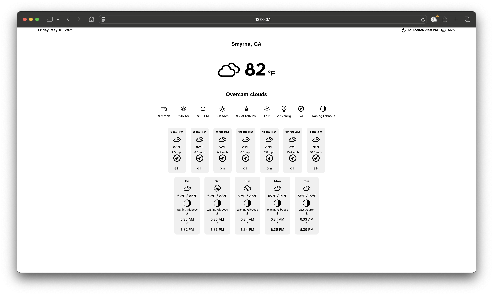

# Ultra-Low-Power Weather Display

[](https://github.com/sjnims/rpi_weather_display/actions/workflows/ci.yml)
[](https://codecov.io/gh/sjnims/rpi_weather_display)
[](https://www.python.org/downloads/release/python-3112/)
[](https://opensource.org/licenses/MIT)
[](https://github.com/astral-sh/ruff)
[](https://github.com/sjnims/rpi_weather_display/security/code-scanning)
[](https://github.com/sjnims/rpi_weather_display/pkgs/container/rpi-weather-display)

A power-optimized weather display solution for Raspberry Pi Zero 2 W with e-paper display, designed to achieve 60-90 days of battery life on a single charge.



## Features

- **Ultra-low power consumption** - 60-90 days battery life
- **E-paper display** - Beautiful weather dashboard with current conditions and forecast
- **Async architecture** - Non-blocking I/O operations for improved efficiency
- **Smart power management** - Battery-aware scheduling and display updates
- **Server-client design** - Offloads processing to server for minimal client power usage
- **Rich configuration** - Highly customizable via YAML configuration
- **Modern Python** - Type-safe code with 94%+ test coverage

## Hardware Requirements

**Client:**
- Raspberry Pi Zero 2 W
- PiJuice Zero HAT
- PiJuice 12,000 mAh LiPo battery
- Waveshare 10.3″ 1872 x 1404 E-paper IT8951 HAT

**Server:**
- Docker-capable Linux server (or Unraid)
- ~500MB RAM, minimal CPU

## Quick Start

```bash
# Client setup (Raspberry Pi)
git clone https://github.com/sjnims/rpi-weather-display.git
cd rpi-weather-display
sudo bash deploy/scripts/install.sh
sudo cp config.example.yaml /etc/rpi-weather-display/config.yaml
sudo nano /etc/rpi-weather-display/config.yaml  # Add your API key

# Server setup (Docker)
docker build -t rpi-weather-display-server .
docker run -d --name rpi-weather-display -p 8000:8000 \
  -v /path/to/config.yaml:/etc/rpi-weather-display/config.yaml \
  rpi-weather-display-server
```

## Architecture


The server handles all computation-intensive tasks (API calls, rendering) while the client focuses on power-efficient display updates.

## Configuration

Copy `config.example.yaml` to `config.yaml` and customize:

```yaml
weather:
  api_key: "YOUR_OPENWEATHERMAP_API_KEY"  # Required
  city_name: "London"
  units: "metric"

display:
  refresh_interval_minutes: 30
  pressure_units: "hPa"  # or "mmHg", "inHg"

power:
  quiet_hours_start: "23:00"
  quiet_hours_end: "06:00"
  low_battery_threshold: 20

server:
  url: "http://your-server-ip"
  port: 8000
```

See [config.example.yaml](config.example.yaml) for all options.

## Development

```bash
# Install Poetry
curl -sSL https://install.python-poetry.org | python3 -

# Install dependencies
poetry install --with dev --extras server

# Run server
poetry run server --config config.yaml

# Run client
poetry run client --config config.yaml

# Run tests
poetry run pytest

# Preview in browser
http://localhost:8000/preview
```

## Documentation

- [Changelog](CHANGELOG.md) - Version history and recent updates
- [Roadmap](ROADMAP.md) - Future development plans
- [Contributing](CONTRIBUTING.md) - How to contribute
- [Operation Guide](docs/OPERATION.md) - Daily operation and updates
- [Troubleshooting](docs/TROUBLESHOOTING.md) - Common issues and solutions
- [Security](docs/SECURITY.md) - Security considerations
- [Power Optimization](docs/POWER_OPTIMIZATION.md) - Battery life details

## Project Structure

```
rpi-weather-display/
├── src/rpi_weather_display/
│   ├── client/        # Raspberry Pi client code
│   ├── server/        # FastAPI server code
│   ├── models/        # Pydantic data models
│   └── utils/         # Shared utilities
├── templates/         # Jinja2 HTML templates
├── static/           # CSS, fonts, icons
├── tests/            # Comprehensive test suite
└── deploy/           # Installation scripts
```

## Contributing

We welcome contributions! Please see our [Contributing Guide](CONTRIBUTING.md) for details.

Key requirements:
- Python 3.11+
- Type hints for all code
- Tests for new functionality (maintain 94%+ coverage)
- Follow existing code style

## Acknowledgements

- [Weather Icons](https://erikflowers.github.io/weather-icons/) - Beautiful weather icons
- [Phosphor Icons](https://phosphoricons.com) - Battery status icons
- [OpenWeatherMap](https://openweathermap.org/) - Weather data API
- [Atkinson Hyperlegible](https://brailleinstitute.org/freefont) - Readable font
- The Raspberry Pi and e-paper display communities for inspiration

Special thanks to:
- [Kimmo Brunfeldt](https://github.com/kimmobrunfeldt/eink-weather-display)
- [Faith Ak](https://github.com/fatihak/InkyPi)

## License

MIT License - see [LICENSE](LICENSE) file for details.